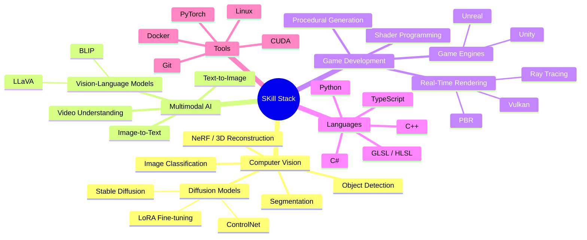

  <picture>
    <source media="(prefers-color-scheme: dark)" srcset="https://raw.githubusercontent.com/new-tonAA/new-tonAA/main/img2.png" />
    <source media="(prefers-color-scheme: light)" srcset="https://raw.githubusercontent.com/new-tonAA/new-tonAA/main/img1.png" />
    
  </picture>

