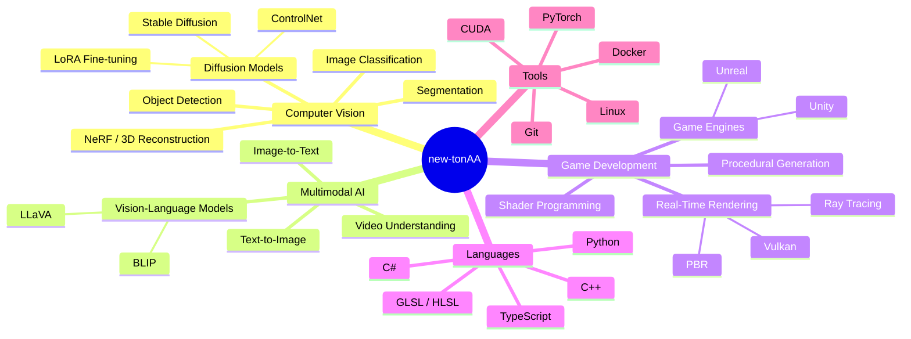
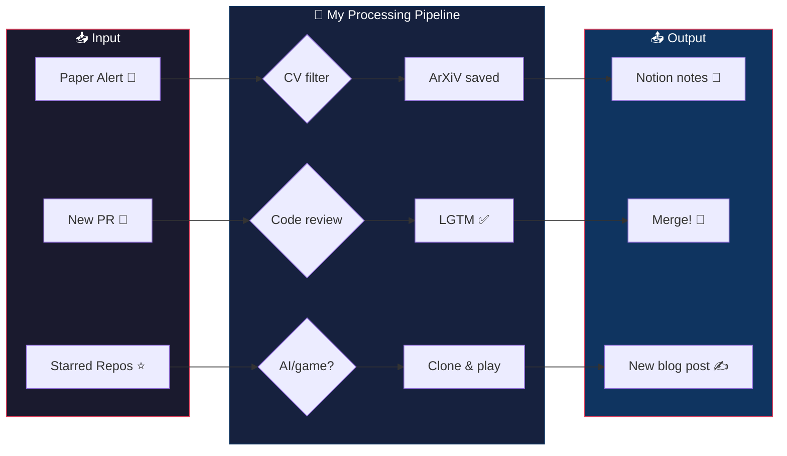

<p align="center">
  <picture>
    <source media="(prefers-color-scheme: dark)" srcset="https://raw.githubusercontent.com/new-tonAA/new-tonAA/main/img2.png" />
    <source media="(prefers-color-scheme: light)" srcset="https://raw.githubusercontent.com/new-tonAA/new-tonAA/main/img1.png" />
    
  </picture>
</p>

<p align="center">
  
</p>

---

<div align="center">
<h3><code>new-tonAA@github ~ $ whoami</code></h3>
<table>
<tr>
<td valign="top">

**🎓 Student** — Software Engineering @ 华南理工大学

**🔬 Research** — Computer Vision & Multimodal AI

**🎮 Hobby** — Game Development & Real-Time Rendering

**📍 Location** — Guangzhou, China 🇨🇳

**🌱 Currently Learning** — Diffusion Models · Vulkan · NeRF

**💬 Ask me about** — Anything computer science!

</td>
<td valign="top">

```
+------------------+
|  > whoami        |
|  new-tonAA       |
|                  |
|  > cat skill.txt |
|  [CV] ████████░░ |
|  [AI] ██████░░░░ |
|  [GDev] ████░░░░ |
|  [C++] ███████░░ |
|  [Python] ██████ |
|                  |
|  > echo $MOTTO   |
|  code. create.   |
|  ship. repeat.   |
+------------------+
```

</td>
</tr>
</table>
</div>

---

## 🌳 The Triple Threat — My Tech Stack Tree

> Computer Vision + Multimodal AI + Game Dev ... wait, that makes three!



## 🎯 What I See When I Open GitHub



---

## 📊 GitHub Stats

<div align="center">

<picture>
  <source media="(prefers-color-scheme: dark)" srcset="https://github-readme-stats.vercel.app/api?username=new-tonAA&show_icons=true&theme=tokyonight&hide_border=true&bg_color=1a1a2e&title_color=e94560&icon_color=e94560&text_color=c9d1d9" />
  <source media="(prefers-color-scheme: light)" srcset="https://github-readme-stats.vercel.app/api?username=new-tonAA&show_icons=true&theme=default&hide_border=true" />
  
</picture>

<picture>
  <source media="(prefers-color-scheme: dark)" srcset="https://github-readme-stats.vercel.app/api/top-langs/?username=new-tonAA&layout=compact&theme=tokyonight&hide_border=true&bg_color=1a1a2e&title_color=e94560&text_color=c9d1d9" />
  <source media="(prefers-color-scheme: light)" srcset="https://github-readme-stats.vercel.app/api/top-langs/?username=new-tonAA&layout=compact&theme=default&hide_border=true" />
  
</picture>

</div>

---

## 🔥 Contribution Heatmap

<div align="center">

</div>

---

## 🎮 Fun Stuff

<div align="center">

### 🤖 CV says: You're looking at my README!

> I trained a small YOLOv8 just for fun. It detected **1 face**, **0 cats**, and **100% curiosity** ✨

### 🧪 Multimodal AI Demo (sort of)

```
┌─ Text → Image → Text Pipeline ─────────────┐
│                                             │
│  Input:  "a cat playing piano in space"     │
│    ↓ Stable Diffusion                      │
│  🖼️  [image generates...]                  │
│    ↓ BLIP Captioning                       │
│  Output: "a cat sitting on a piano         │
│           floating in outer space,          │
│           surrounded by stars"              │
│                                             │
│  ...close enough. 🎹🐱🌌                    │
└─────────────────────────────────────────────┘
```

### 🕹️ Game Dev Meme

```
> unity.exe has stopped working
> UnrealEditor.exe has stopped working  
> Godot_v4.exe is working perfectly fine ✨
> ...I use all three, don't @ me
```

</div>

---

## 📬 Let's Connect

<div align="center">

[](https://github.com/new-tonAA)
[](https://github.com/new-tonAA)

</div>

<!--TIMESTAMP_START-->
<div align="center">

---
🕐 **Last update:** &nbsp; `2026-09-29  23:10 (CST)`
⏩ **Next update:** &nbsp; `2026-10-06  00:00 (CST)`

</div>
<!--TIMESTAMP_END-->

<div align="center">
Made with ❤️, ☕, and way too many semicolons.
</div>